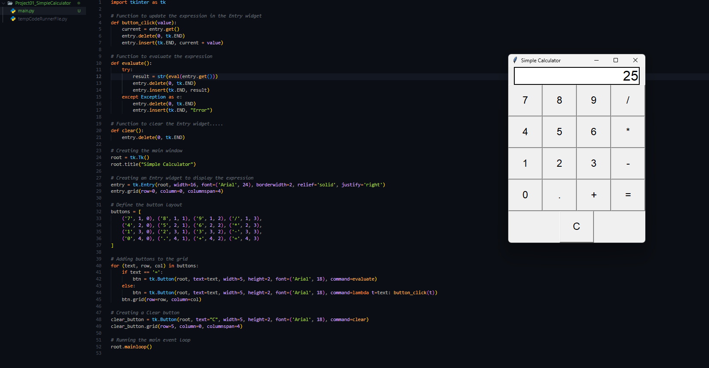

# Simple Calculator with Tkinter (Python) 
# ABHISHEK SHARMA 590016458(MCA)
A simple, graphical user interface (GUI)-based calculator built using the `tkinter` library in Python. 
This calculator supports basic arithmetic operations including addition, subtraction, multiplication, and division. 
## Features - 
- **Basic Arithmetic Operations**
- **Addition, subtraction, multiplication, and division.**
- **Interactive GUI** : Easy-to-use interface for input and output.**
- **Error Handling** : Displays an error message for invalid expressions.
- **Clear Button**: Reset the calculator display with one click. 
- ## Screenshot  
- ## Requirements 
- Python 3 
- Tkinter library (usually comes pre-installed with Python) 
- ## Installation ### 
- 1. Clone this repository -> **git clone https://github.com/iamprashu/PYTHON_PROJECT cd PYTHON_PROJECT cd Project01_SimpleCalculator**
- 2. Install Python (if not already installed) :Make sure you have Python 3.x installed. You can download it from the official [Python website](https://www.python.org/downloads/).
- 3. Run the Calculator : Simply run the Python script to launch the calculator 
	- **Use python calc.py** 
	## How It Works

### GUI Layout

-   **Entry Widget**: Displays the current expression and result.
-   **Buttons**: A grid of buttons representing digits (0-9), operators (`+`, `-`, `*`, `/`), and special functions (`=`, `C`).
    -   `C`: Clears the display.
    -   `=`: Computes the result of the expression.

### Functions

-   **`button_click(value)`**: Appends the value (number/operator) to the expression in the entry field.
-   **`evaluate()`**: Evaluates the expression using Python's `eval()` function and displays the result.
-   **`clear()`**: Clears the input display.

## Example Usage

1.  Click the buttons to enter an expression.
2.  Click the `=` button to calculate the result.
3.  Use the `C` button to clear the display.

### Example Workflow:

-   Enter `5`, then `+`, then `3`.
-   Press `=`, and the result `8` will appear. 

### Thank You.
